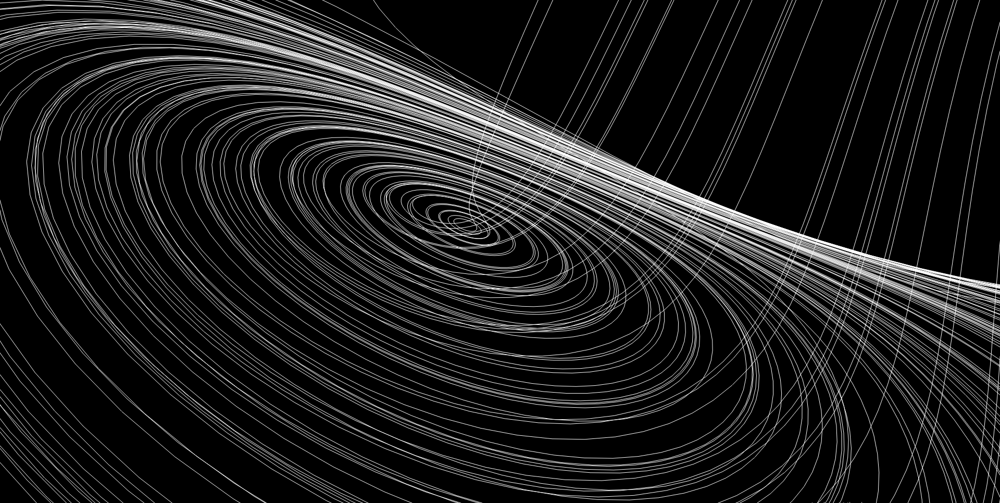
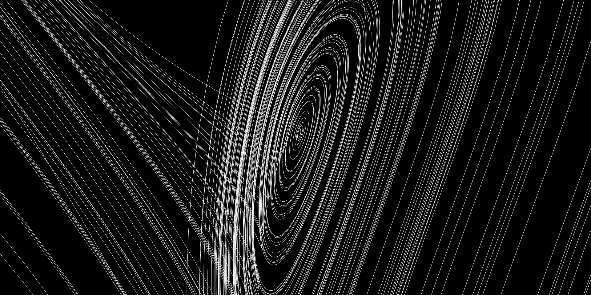

# PyQtGraph-OpenGL

Here I simulated some famous attractors using **PyQtGraph** and **OpenGL**

You can use all the code with no restrictions. 

## Steps for running the code
- install libraries
- done

## Install **PyQtGraph**, **PyOpenGL** and **numpy**

```python
pip install pytqtgraph
```
```python
pip install pytqtgraph.opengl
```
```python
pip install numpy
```



made by [Sinho Graphics](https://www.instagram.com/sinho_graphics).
